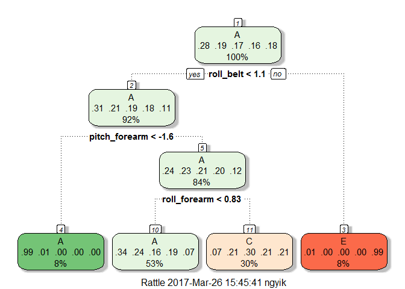

# Practical Machine Learning Course Project
John Ng  

## Introduction

Using devices such as Jawbone Up, Nike FuelBand, and Fitbit it is now possible 
to collect a large amount of data about personal activity relatively 
inexpensively. These type of devices are part of the quantified self movement - 
a group of enthusiasts who take measurements about themselves regularly to 
improve their health, to find patterns in their behavior, or because they are 
tech geeks. One thing that people regularly do is quantify how much of a 
particular activity they do, but they rarely quantify how well they do it.   

In this project, 6 participants were asked to perform barbell lifts in 5 
different ways as follows.  

1. Exactly according to the specification (Class A)  
2. Throwing the elbows to the front (Class B)  
3. Lifting the dumbbell only halfway (Class C)  
4. Lowering the dumbbell only halfway (Class D)  
5. Throwing the hips to the front (Class E)

I will use data from accelerometers on the belt, forearm, arm and dumbell to 
predict their performance using classification tree or random forest. The 
accuracy will be measured and the best model will be chosen. Lastly, we will use 
the best prediction model to predict the preformance of 20 barbell lift.  

The data we are using is coming from the website http://groupware.les.inf.puc-rio.br/har.

##Load Package

A number of packages are required to load, including `caret`, `rpart`, `rattle` 
and `randomForest`.


```r
library(caret)
```

```
## Loading required package: lattice
```

```
## Loading required package: ggplot2
```

```r
library(rpart)
library(rattle)
```

```
## Rattle: A free graphical interface for data mining with R.
## Version 4.1.0 Copyright (c) 2006-2015 Togaware Pty Ltd.
## Type 'rattle()' to shake, rattle, and roll your data.
```

```r
library(randomForest)
```

```
## randomForest 4.6-12
```

```
## Type rfNews() to see new features/changes/bug fixes.
```

```
## 
## Attaching package: 'randomForest'
```

```
## The following object is masked from 'package:ggplot2':
## 
##     margin
```

##Loading the data

We first read the 
[training dataset](https://d396qusza40orc.cloudfront.net/predmachlearn/pml-training.csv) 
and [testing dataset](https://d396qusza40orc.cloudfront.net/predmachlearn/pml-testing.csv) 
we downloaded from the course website.


```r
TrainSet <- read.csv("pml-training.csv", sep=",", header=TRUE, na.strings = c("NA", "#DIV/0!"))
TestSet <- read.csv("pml-testing.csv", sep=",", header=TRUE, na.strings = c("NA", "#DIV/0!"))
dim(TrainSet)
```

```
## [1] 19622   160
```

```r
dim(TestSet)
```

```
## [1]  20 160
```

Let's take a look at the first few rows of the data.


```r
head(TrainSet)
```

```
##   X user_name raw_timestamp_part_1 raw_timestamp_part_2   cvtd_timestamp
## 1 1  carlitos           1323084231               788290 05/12/2011 11:23
## 2 2  carlitos           1323084231               808298 05/12/2011 11:23
## 3 3  carlitos           1323084231               820366 05/12/2011 11:23
## 4 4  carlitos           1323084232               120339 05/12/2011 11:23
## 5 5  carlitos           1323084232               196328 05/12/2011 11:23
## 6 6  carlitos           1323084232               304277 05/12/2011 11:23
##   new_window num_window roll_belt pitch_belt yaw_belt total_accel_belt
## 1         no         11      1.41       8.07    -94.4                3
## 2         no         11      1.41       8.07    -94.4                3
## 3         no         11      1.42       8.07    -94.4                3
## 4         no         12      1.48       8.05    -94.4                3
## 5         no         12      1.48       8.07    -94.4                3
## 6         no         12      1.45       8.06    -94.4                3
##   kurtosis_roll_belt kurtosis_picth_belt kurtosis_yaw_belt
## 1                 NA                  NA                NA
## 2                 NA                  NA                NA
## 3                 NA                  NA                NA
## 4                 NA                  NA                NA
## 5                 NA                  NA                NA
## 6                 NA                  NA                NA
##   skewness_roll_belt skewness_roll_belt.1 skewness_yaw_belt max_roll_belt
## 1                 NA                   NA                NA            NA
## 2                 NA                   NA                NA            NA
## 3                 NA                   NA                NA            NA
## 4                 NA                   NA                NA            NA
## 5                 NA                   NA                NA            NA
## 6                 NA                   NA                NA            NA
##   max_picth_belt max_yaw_belt min_roll_belt min_pitch_belt min_yaw_belt
## 1             NA           NA            NA             NA           NA
## 2             NA           NA            NA             NA           NA
## 3             NA           NA            NA             NA           NA
## 4             NA           NA            NA             NA           NA
## 5             NA           NA            NA             NA           NA
## 6             NA           NA            NA             NA           NA
##   amplitude_roll_belt amplitude_pitch_belt amplitude_yaw_belt
## 1                  NA                   NA                 NA
## 2                  NA                   NA                 NA
## 3                  NA                   NA                 NA
## 4                  NA                   NA                 NA
## 5                  NA                   NA                 NA
## 6                  NA                   NA                 NA
##   var_total_accel_belt avg_roll_belt stddev_roll_belt var_roll_belt
## 1                   NA            NA               NA            NA
## 2                   NA            NA               NA            NA
## 3                   NA            NA               NA            NA
## 4                   NA            NA               NA            NA
## 5                   NA            NA               NA            NA
## 6                   NA            NA               NA            NA
##   avg_pitch_belt stddev_pitch_belt var_pitch_belt avg_yaw_belt
## 1             NA                NA             NA           NA
## 2             NA                NA             NA           NA
## 3             NA                NA             NA           NA
## 4             NA                NA             NA           NA
## 5             NA                NA             NA           NA
## 6             NA                NA             NA           NA
##   stddev_yaw_belt var_yaw_belt gyros_belt_x gyros_belt_y gyros_belt_z
## 1              NA           NA         0.00         0.00        -0.02
## 2              NA           NA         0.02         0.00        -0.02
## 3              NA           NA         0.00         0.00        -0.02
## 4              NA           NA         0.02         0.00        -0.03
## 5              NA           NA         0.02         0.02        -0.02
## 6              NA           NA         0.02         0.00        -0.02
##   accel_belt_x accel_belt_y accel_belt_z magnet_belt_x magnet_belt_y
## 1          -21            4           22            -3           599
## 2          -22            4           22            -7           608
## 3          -20            5           23            -2           600
## 4          -22            3           21            -6           604
## 5          -21            2           24            -6           600
## 6          -21            4           21             0           603
##   magnet_belt_z roll_arm pitch_arm yaw_arm total_accel_arm var_accel_arm
## 1          -313     -128      22.5    -161              34            NA
## 2          -311     -128      22.5    -161              34            NA
## 3          -305     -128      22.5    -161              34            NA
## 4          -310     -128      22.1    -161              34            NA
## 5          -302     -128      22.1    -161              34            NA
## 6          -312     -128      22.0    -161              34            NA
##   avg_roll_arm stddev_roll_arm var_roll_arm avg_pitch_arm stddev_pitch_arm
## 1           NA              NA           NA            NA               NA
## 2           NA              NA           NA            NA               NA
## 3           NA              NA           NA            NA               NA
## 4           NA              NA           NA            NA               NA
## 5           NA              NA           NA            NA               NA
## 6           NA              NA           NA            NA               NA
##   var_pitch_arm avg_yaw_arm stddev_yaw_arm var_yaw_arm gyros_arm_x
## 1            NA          NA             NA          NA        0.00
## 2            NA          NA             NA          NA        0.02
## 3            NA          NA             NA          NA        0.02
## 4            NA          NA             NA          NA        0.02
## 5            NA          NA             NA          NA        0.00
## 6            NA          NA             NA          NA        0.02
##   gyros_arm_y gyros_arm_z accel_arm_x accel_arm_y accel_arm_z magnet_arm_x
## 1        0.00       -0.02        -288         109        -123         -368
## 2       -0.02       -0.02        -290         110        -125         -369
## 3       -0.02       -0.02        -289         110        -126         -368
## 4       -0.03        0.02        -289         111        -123         -372
## 5       -0.03        0.00        -289         111        -123         -374
## 6       -0.03        0.00        -289         111        -122         -369
##   magnet_arm_y magnet_arm_z kurtosis_roll_arm kurtosis_picth_arm
## 1          337          516                NA                 NA
## 2          337          513                NA                 NA
## 3          344          513                NA                 NA
## 4          344          512                NA                 NA
## 5          337          506                NA                 NA
## 6          342          513                NA                 NA
##   kurtosis_yaw_arm skewness_roll_arm skewness_pitch_arm skewness_yaw_arm
## 1               NA                NA                 NA               NA
## 2               NA                NA                 NA               NA
## 3               NA                NA                 NA               NA
## 4               NA                NA                 NA               NA
## 5               NA                NA                 NA               NA
## 6               NA                NA                 NA               NA
##   max_roll_arm max_picth_arm max_yaw_arm min_roll_arm min_pitch_arm
## 1           NA            NA          NA           NA            NA
## 2           NA            NA          NA           NA            NA
## 3           NA            NA          NA           NA            NA
## 4           NA            NA          NA           NA            NA
## 5           NA            NA          NA           NA            NA
## 6           NA            NA          NA           NA            NA
##   min_yaw_arm amplitude_roll_arm amplitude_pitch_arm amplitude_yaw_arm
## 1          NA                 NA                  NA                NA
## 2          NA                 NA                  NA                NA
## 3          NA                 NA                  NA                NA
## 4          NA                 NA                  NA                NA
## 5          NA                 NA                  NA                NA
## 6          NA                 NA                  NA                NA
##   roll_dumbbell pitch_dumbbell yaw_dumbbell kurtosis_roll_dumbbell
## 1      13.05217      -70.49400    -84.87394                     NA
## 2      13.13074      -70.63751    -84.71065                     NA
## 3      12.85075      -70.27812    -85.14078                     NA
## 4      13.43120      -70.39379    -84.87363                     NA
## 5      13.37872      -70.42856    -84.85306                     NA
## 6      13.38246      -70.81759    -84.46500                     NA
##   kurtosis_picth_dumbbell kurtosis_yaw_dumbbell skewness_roll_dumbbell
## 1                      NA                    NA                     NA
## 2                      NA                    NA                     NA
## 3                      NA                    NA                     NA
## 4                      NA                    NA                     NA
## 5                      NA                    NA                     NA
## 6                      NA                    NA                     NA
##   skewness_pitch_dumbbell skewness_yaw_dumbbell max_roll_dumbbell
## 1                      NA                    NA                NA
## 2                      NA                    NA                NA
## 3                      NA                    NA                NA
## 4                      NA                    NA                NA
## 5                      NA                    NA                NA
## 6                      NA                    NA                NA
##   max_picth_dumbbell max_yaw_dumbbell min_roll_dumbbell min_pitch_dumbbell
## 1                 NA               NA                NA                 NA
## 2                 NA               NA                NA                 NA
## 3                 NA               NA                NA                 NA
## 4                 NA               NA                NA                 NA
## 5                 NA               NA                NA                 NA
## 6                 NA               NA                NA                 NA
##   min_yaw_dumbbell amplitude_roll_dumbbell amplitude_pitch_dumbbell
## 1               NA                      NA                       NA
## 2               NA                      NA                       NA
## 3               NA                      NA                       NA
## 4               NA                      NA                       NA
## 5               NA                      NA                       NA
## 6               NA                      NA                       NA
##   amplitude_yaw_dumbbell total_accel_dumbbell var_accel_dumbbell
## 1                     NA                   37                 NA
## 2                     NA                   37                 NA
## 3                     NA                   37                 NA
## 4                     NA                   37                 NA
## 5                     NA                   37                 NA
## 6                     NA                   37                 NA
##   avg_roll_dumbbell stddev_roll_dumbbell var_roll_dumbbell
## 1                NA                   NA                NA
## 2                NA                   NA                NA
## 3                NA                   NA                NA
## 4                NA                   NA                NA
## 5                NA                   NA                NA
## 6                NA                   NA                NA
##   avg_pitch_dumbbell stddev_pitch_dumbbell var_pitch_dumbbell
## 1                 NA                    NA                 NA
## 2                 NA                    NA                 NA
## 3                 NA                    NA                 NA
## 4                 NA                    NA                 NA
## 5                 NA                    NA                 NA
## 6                 NA                    NA                 NA
##   avg_yaw_dumbbell stddev_yaw_dumbbell var_yaw_dumbbell gyros_dumbbell_x
## 1               NA                  NA               NA                0
## 2               NA                  NA               NA                0
## 3               NA                  NA               NA                0
## 4               NA                  NA               NA                0
## 5               NA                  NA               NA                0
## 6               NA                  NA               NA                0
##   gyros_dumbbell_y gyros_dumbbell_z accel_dumbbell_x accel_dumbbell_y
## 1            -0.02             0.00             -234               47
## 2            -0.02             0.00             -233               47
## 3            -0.02             0.00             -232               46
## 4            -0.02            -0.02             -232               48
## 5            -0.02             0.00             -233               48
## 6            -0.02             0.00             -234               48
##   accel_dumbbell_z magnet_dumbbell_x magnet_dumbbell_y magnet_dumbbell_z
## 1             -271              -559               293               -65
## 2             -269              -555               296               -64
## 3             -270              -561               298               -63
## 4             -269              -552               303               -60
## 5             -270              -554               292               -68
## 6             -269              -558               294               -66
##   roll_forearm pitch_forearm yaw_forearm kurtosis_roll_forearm
## 1         28.4         -63.9        -153                    NA
## 2         28.3         -63.9        -153                    NA
## 3         28.3         -63.9        -152                    NA
## 4         28.1         -63.9        -152                    NA
## 5         28.0         -63.9        -152                    NA
## 6         27.9         -63.9        -152                    NA
##   kurtosis_picth_forearm kurtosis_yaw_forearm skewness_roll_forearm
## 1                     NA                   NA                    NA
## 2                     NA                   NA                    NA
## 3                     NA                   NA                    NA
## 4                     NA                   NA                    NA
## 5                     NA                   NA                    NA
## 6                     NA                   NA                    NA
##   skewness_pitch_forearm skewness_yaw_forearm max_roll_forearm
## 1                     NA                   NA               NA
## 2                     NA                   NA               NA
## 3                     NA                   NA               NA
## 4                     NA                   NA               NA
## 5                     NA                   NA               NA
## 6                     NA                   NA               NA
##   max_picth_forearm max_yaw_forearm min_roll_forearm min_pitch_forearm
## 1                NA              NA               NA                NA
## 2                NA              NA               NA                NA
## 3                NA              NA               NA                NA
## 4                NA              NA               NA                NA
## 5                NA              NA               NA                NA
## 6                NA              NA               NA                NA
##   min_yaw_forearm amplitude_roll_forearm amplitude_pitch_forearm
## 1              NA                     NA                      NA
## 2              NA                     NA                      NA
## 3              NA                     NA                      NA
## 4              NA                     NA                      NA
## 5              NA                     NA                      NA
## 6              NA                     NA                      NA
##   amplitude_yaw_forearm total_accel_forearm var_accel_forearm
## 1                    NA                  36                NA
## 2                    NA                  36                NA
## 3                    NA                  36                NA
## 4                    NA                  36                NA
## 5                    NA                  36                NA
## 6                    NA                  36                NA
##   avg_roll_forearm stddev_roll_forearm var_roll_forearm avg_pitch_forearm
## 1               NA                  NA               NA                NA
## 2               NA                  NA               NA                NA
## 3               NA                  NA               NA                NA
## 4               NA                  NA               NA                NA
## 5               NA                  NA               NA                NA
## 6               NA                  NA               NA                NA
##   stddev_pitch_forearm var_pitch_forearm avg_yaw_forearm
## 1                   NA                NA              NA
## 2                   NA                NA              NA
## 3                   NA                NA              NA
## 4                   NA                NA              NA
## 5                   NA                NA              NA
## 6                   NA                NA              NA
##   stddev_yaw_forearm var_yaw_forearm gyros_forearm_x gyros_forearm_y
## 1                 NA              NA            0.03            0.00
## 2                 NA              NA            0.02            0.00
## 3                 NA              NA            0.03           -0.02
## 4                 NA              NA            0.02           -0.02
## 5                 NA              NA            0.02            0.00
## 6                 NA              NA            0.02           -0.02
##   gyros_forearm_z accel_forearm_x accel_forearm_y accel_forearm_z
## 1           -0.02             192             203            -215
## 2           -0.02             192             203            -216
## 3            0.00             196             204            -213
## 4            0.00             189             206            -214
## 5           -0.02             189             206            -214
## 6           -0.03             193             203            -215
##   magnet_forearm_x magnet_forearm_y magnet_forearm_z classe
## 1              -17              654              476      A
## 2              -18              661              473      A
## 3              -18              658              469      A
## 4              -16              658              469      A
## 5              -17              655              473      A
## 6               -9              660              478      A
```

After viewing the data, it is found that a number of fields are having NA value. 
It would be a good idea if we remove these NA columns and not using this in the 
prediction model. The NA columns will also be removed in the final testing set.


```r
TrainSet <- TrainSet[,(colSums(is.na(TrainSet)) == 0)]
dim(TrainSet)
```

```
## [1] 19622    60
```

```r
TestSet <- TestSet[,(colSums(is.na(TestSet)) == 0)]
dim(TestSet)
```

```
## [1] 20 60
```

We also preprocess our data before building model.


```r
NumIndex <- which(lapply(TrainSet, class) %in% "numeric")

PreProcessModel <-preProcess(TrainSet[, NumIndex], method=c('center', 'scale'))

PreProcessedTrainSet <- predict(PreProcessModel, TrainSet[, NumIndex])
PreProcessedTrainSet$classe <- TrainSet$classe

PreProcessedTestSet <-predict(PreProcessModel, TestSet[, NumIndex])
```

## Making Training and Testing Data Partition

In order to perform cross-validation, a training subset for model prediction is 
created with 60% of the original training set and the remaining 40% to be used 
as the testing set for us to measure the accuracy and select the best model.


```r
set.seed(12031987)
inTrain = createDataPartition(PreProcessedTrainSet$classe, p=0.75, list=FALSE)
TrainingData = PreProcessedTrainSet[ inTrain,]
ValidateData = PreProcessedTrainSet[-inTrain,]
```

The training subset have 14718 records while the testing subset 
have 4904 records.

## Prediction Model 

We are going to use Classification Tree and Random Forest to predict the result.

### Classification Tree

The following R Code build a classification tree model on the training subset.


```r
mod_rpart <-train(classe~.,method="rpart", data=TrainingData)
print(mod_rpart$finalModel)
```

```
## n= 14718 
## 
## node), split, n, loss, yval, (yprob)
##       * denotes terminal node
## 
##  1) root 14718 10533 A (0.28 0.19 0.17 0.16 0.18)  
##    2) roll_belt< 1.053267 13490  9315 A (0.31 0.21 0.19 0.18 0.11)  
##      4) pitch_forearm< -1.58661 1174     8 A (0.99 0.0068 0 0 0) *
##      5) pitch_forearm>=-1.58661 12316  9307 A (0.24 0.23 0.21 0.2 0.12)  
##       10) roll_forearm< 0.8300342 7844  5147 A (0.34 0.24 0.16 0.19 0.068) *
##       11) roll_forearm>=0.8300342 4472  3135 C (0.07 0.21 0.3 0.21 0.21) *
##    3) roll_belt>=1.053267 1228    10 E (0.0081 0 0 0 0.99) *
```

```r
fancyRpartPlot(mod_rpart$finalModel)
```

<!-- -->

### Random Forest

The following R Code build a random forest model on the training subset.


```r
mod_rf <-train(classe~.,method="rf", data=TrainingData, 
               trControl=trainControl(method='cv'), number=5, 
               allowParallel=TRUE, importance=TRUE)
print(mod_rf)
```

```
## Random Forest 
## 
## 14718 samples
##    27 predictor
##     5 classes: 'A', 'B', 'C', 'D', 'E' 
## 
## No pre-processing
## Resampling: Cross-Validated (10 fold) 
## Summary of sample sizes: 13246, 13245, 13247, 13246, 13245, 13246, ... 
## Resampling results across tuning parameters:
## 
##   mtry  Accuracy   Kappa    
##    2    0.9934773  0.9917491
##   14    0.9925940  0.9906326
##   27    0.9895367  0.9867661
## 
## Accuracy was used to select the optimal model using  the largest value.
## The final value used for the model was mtry = 2.
```

## Model Evaluation

We build two model, Classification Tree and Random Forest, from the training 
subset of the data. We now use the training subset data to predict the result 
and compare with the actual result to build a confusion Matrix. Accuracy of the 
Prediction is recorded and is used to evaluate the best model for the final 
prediction on the 20 testing data.

### Classification Tree

The confusion Matrix of Classification Tree is generated on the testing subset 
data.


```r
predict_rpart <- predict(mod_rpart, ValidateData)
confmat_rpart <- confusionMatrix(ValidateData$classe, predict_rpart)
confmat_rpart
```

```
## Confusion Matrix and Statistics
## 
##           Reference
## Prediction    A    B    C    D    E
##          A 1297    0   94    0    4
##          B  623    0  326    0    0
##          C  410    0  445    0    0
##          D  507    0  297    0    0
##          E  201    0  287    0  413
## 
## Overall Statistics
##                                           
##                Accuracy : 0.4394          
##                  95% CI : (0.4255, 0.4535)
##     No Information Rate : 0.6195          
##     P-Value [Acc > NIR] : 1               
##                                           
##                   Kappa : 0.2591          
##  Mcnemar's Test P-Value : NA              
## 
## Statistics by Class:
## 
##                      Class: A Class: B Class: C Class: D Class: E
## Sensitivity            0.4269       NA  0.30711       NA  0.99041
## Specificity            0.9475   0.8065  0.88133   0.8361  0.89124
## Pos Pred Value         0.9297       NA  0.52047       NA  0.45838
## Neg Pred Value         0.5038       NA  0.75204       NA  0.99900
## Prevalence             0.6195   0.0000  0.29547   0.0000  0.08503
## Detection Rate         0.2645   0.0000  0.09074   0.0000  0.08422
## Detection Prevalence   0.2845   0.1935  0.17435   0.1639  0.18373
## Balanced Accuracy      0.6872       NA  0.59422       NA  0.94082
```

The confusion Matrix of Random Forest is generated on the testing subset data.

### Random Forest

```r
predict_rf <- predict(mod_rf, ValidateData)
confmat_rf <- confusionMatrix(ValidateData$classe, predict_rf)
confmat_rf
```

```
## Confusion Matrix and Statistics
## 
##           Reference
## Prediction    A    B    C    D    E
##          A 1391    2    0    0    2
##          B    2  945    2    0    0
##          C    0    2  852    1    0
##          D    0    0    4  798    2
##          E    0    0    0    3  898
## 
## Overall Statistics
##                                           
##                Accuracy : 0.9959          
##                  95% CI : (0.9937, 0.9975)
##     No Information Rate : 0.2841          
##     P-Value [Acc > NIR] : < 2.2e-16       
##                                           
##                   Kappa : 0.9948          
##  Mcnemar's Test P-Value : NA              
## 
## Statistics by Class:
## 
##                      Class: A Class: B Class: C Class: D Class: E
## Sensitivity            0.9986   0.9958   0.9930   0.9950   0.9956
## Specificity            0.9989   0.9990   0.9993   0.9985   0.9993
## Pos Pred Value         0.9971   0.9958   0.9965   0.9925   0.9967
## Neg Pred Value         0.9994   0.9990   0.9985   0.9990   0.9990
## Prevalence             0.2841   0.1935   0.1750   0.1635   0.1839
## Detection Rate         0.2836   0.1927   0.1737   0.1627   0.1831
## Detection Prevalence   0.2845   0.1935   0.1743   0.1639   0.1837
## Balanced Accuracy      0.9987   0.9974   0.9961   0.9968   0.9974
```

Accuracy of Classification Tree: 0.4394372  
Accuracy of Random Forest: 0.9959217  
By comparing the accuracy of the two model, we finally choose Random Forest for 
the Prediction of the Testing Set.

## Prediction on Training Set

We now apply Random Forest to the Prediction and the result is shown as follows.


```r
PredictTest <- predict(mod_rf, PreProcessedTestSet)
PredictTest
```

```
##  [1] B A B A A E D B A A B C B A E E A B B B
## Levels: A B C D E
```

After checking with the final answer, the accuracy is 100%.
